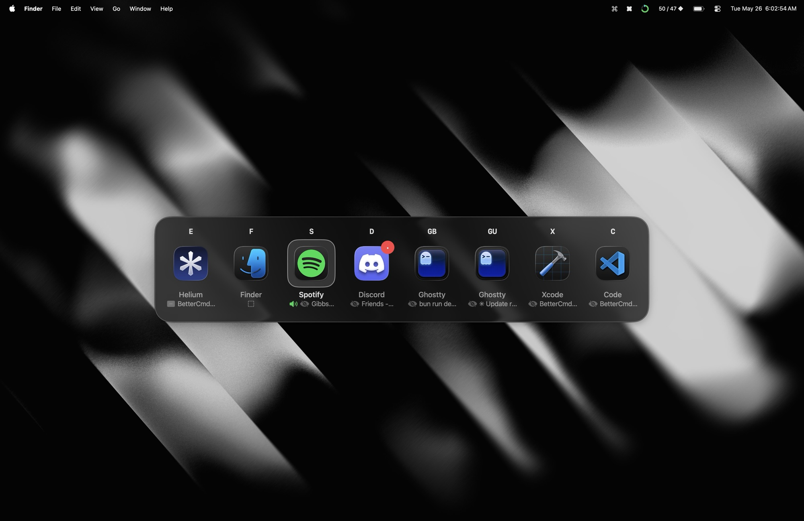
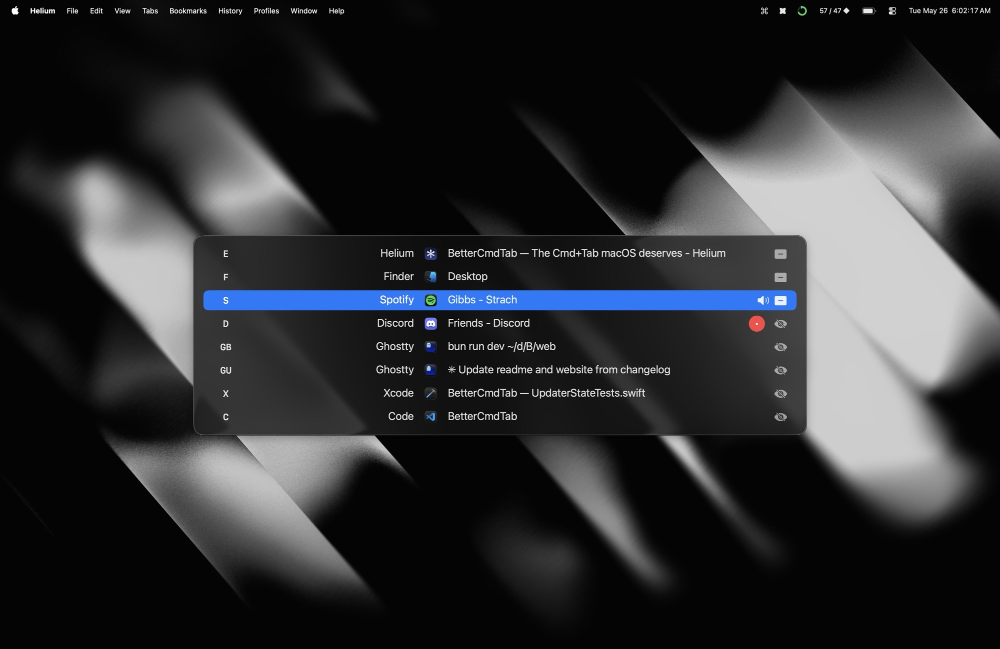

<div align="center">


# BetterCmdTab

**The ⌘+Tab macOS deserves.**

Fast · Native · Liquid Glass · Zero telemetry · Free forever

[](https://github.com/rokartur/BetterCmdTab/releases/latest)

<p>
  <a href="https://github.com/rokartur/BetterCmdTab/releases/latest"></a>
  
  <a href="https://github.com/rokartur/BetterCmdTab/releases"></a>
</p>

<sub>
  <a href="#install">Install</a> ·
  <a href="#features">Features</a> ·
  <a href="#build-from-source">Build</a> ·
  <a href="#contributing">Contribute</a>
</sub>

<br />
<br />





</div>

## Features

### Switching & Navigation

- **Three layouts** — classic list, grid of icons, or live window previews.
- **Letter-prefix jump** — type a name to jump to it.
- **Search & launch** — press `/` to fuzzy-find, or launch any installed app.
- **Window switching** — `` ⌘+ ` `` cycles windows of the front app.
- **Tap or hold** — tap to switch instantly, hold to open the switcher.
- **Scroll to switch** — spin the mouse wheel to move through apps.
- **Multi-monitor** — opens on the screen under the cursor.

### Window & Tab Management

- **Window titles** — show each window's title under its icon in Grid and Previews.
- **Tab drill-in** — press `\` on a row whose window has tabs to pick a specific tab (Safari, Chrome, Arc, Brave, Edge, Vivaldi, Opera, Dia, Finder, Terminal, iTerm).
- **Tabs as rows** — optionally surface each native or browser tab as its own row, not just behind the `\` peek.
- **Quick actions** — quit, close, minimize, maximize, hide inline.
- **Hover actions** — quick-action buttons appear on hover: close, minimize, zoom, hide, quit, force-quit.
- **Window management** — tile windows to halves or corners, maximize, or center with `⌃⌘` arrows; press the tile key again to cycle ½ → ⅔ → ⅓ widths.
- **Move windows** — send the highlighted window to the next display.

### Filtering & Organization

- **Sort order** — order apps by recents (MRU), alphabetically, or launch order.
- **Scoped shortcuts** — a global hotkey that opens the switcher pre-filtered to all windows, the current Space, the current app's windows, or minimized only.
- **Current Space only** — show just the windows on the Space you're on.
- **Minimized & hidden** — include minimized windows, hidden and windowless apps.
- **Pin & filter** — keep favorites up top, hide the rest.
- **Per-app rules** — hide an app, or have it ignore ⌘Tab always or only when fullscreen.

### Productivity & Workflow

- **App hotkeys** — assign a global shortcut to focus or launch a chosen app (9 slots).
- **Recently closed** — reopen an app you just quit.
- **Unread badges** — Dock badge counts, in the switcher.
- **Audio indicator** — flags apps playing sound.
- **Instant Spaces** — switch Spaces with no animation.

### Reliability & Power Features

- **Force quit** — `⌘+⌥+Q` SIGKILLs the highlighted app for when graceful Quit hangs.
- **Secure-input survivor** — ⌘Tab and window management keep working even while a password field holds Secure Event Input.

### Appearance & Customization

- **Liquid Glass** — system material on macOS 26.
- **Theming** — panel opacity, corner radius, background material, and a custom accent color.
- **Configurable** — custom hotkey, size, scale, layout, grid columns, and reveal delay.

### Gestures & Feedback

- **Trackpad & haptics** — three-finger swipe to open the switcher or switch Spaces, with optional haptic and click feedback.

### Privacy & Backup

- **Hide from screen sharing** — keep the switcher out of screen recordings and shared screens. Needs macOS 14.6+.
- **Export & import** — back up and move your whole setup as a versioned `.cmdtab` file.

## Install

### Requirements

- macOS 13.0 (Ventura) or newer
- Accessibility permission

### Homebrew
```bash
brew install --cask bettercmdtab
```

### Download

Grab the latest signed `.dmg` from the [Releases page](https://github.com/rokartur/BetterCmdTab/releases), open it, drag `BetterCmdTab.app` to `/Applications`, and launch.

On first launch macOS will ask for **Accessibility** permission — this is required for the global ⌘+Tab event tap and for reading window lists via the Accessibility API. Grant it under `System Settings → Privacy & Security → Accessibility`.

### Build from source

If you prefer building it yourself from source, see [this section in CONTRIBUTING.md](CONTRIBUTING.md#Building) for instructions.

## Privacy

BetterCmdTab does not collect, transmit, or store any data. There is no telemetry, no crash reporting service, no analytics SDK, and no account. The only network requests it makes are to `api.github.com` and `github.com` when checking for updates, and only when you ask it to.

## Contributing

Issues and pull requests welcome. See [CONTRIBUTING.md](CONTRIBUTING.md) for project layout, build / test instructions, and PR guidelines.

## License

GPL v3. See [LICENSE](LICENSE).

BetterCmdTab is licensed under the GNU General Public License v3.0. You are free to use, study, modify, and redistribute it — including for commercial purposes — but any distributed derivative work must also be released under GPL v3 with full source code. This keeps the project and any fork of it open, forever.

## Credits

Built by [@rokartur](https://github.com/rokartur). Inspired by [AltTab](https://alt-tab.app/), [Witch](https://manytricks.com/witch/), and [Contexts](https://contexts.co/).
